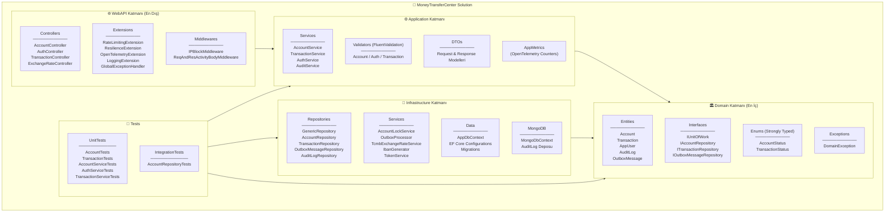
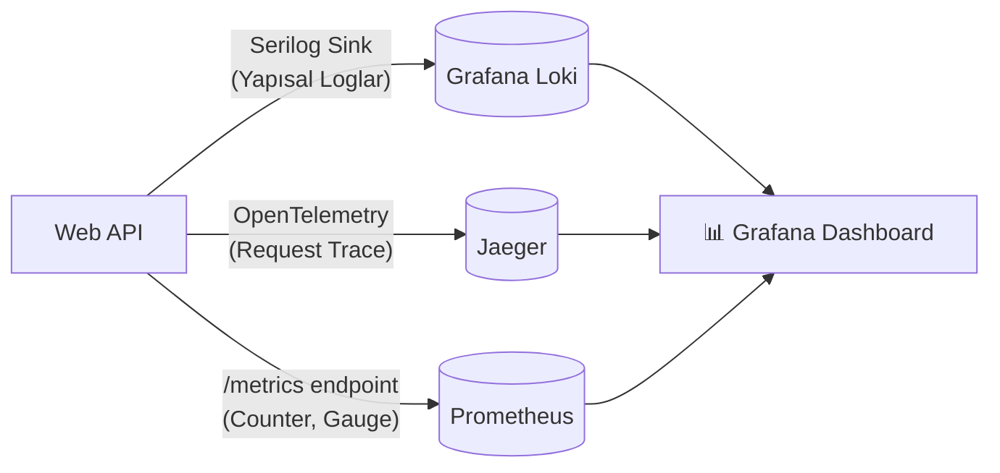
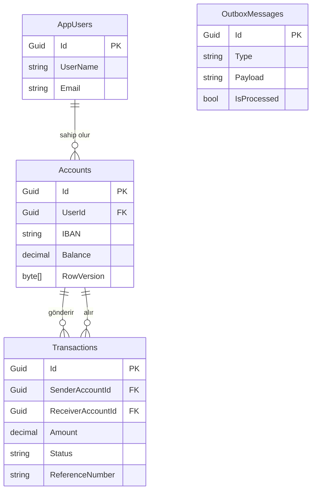

<div align="center">

# 🏦 Money Transfer Center

### Kurumsal Seviyede Finansal İşlem Altyapısı

**Race Condition Koruması · Composite Index Optimizasyonu · Tam Gözlemlenebilirlik (Full Observability)**

[](https://dotnet.microsoft.com/)
[](https://www.docker.com/)
[](https://www.microsoft.com/)
[](https://www.mongodb.com/)
[](https://grafana.com/)
[](https://www.jaegertracing.io/)

</div>

---

## 📖 Proje Hakkında

**Money Transfer Center**, para yatırma, çekme ve hesaplar arası transfer işlemlerini yöneten, **kurumsal (enterprise) seviyede** .NET backend projesidir. Sistem;

- Aynı anda gelen isteklerde paranın asla eksiye düşmemesini garanti eden **Concurrency kilitleri**,
- Milyonlarca kayıt içinde sorguları milisaniyeler içinde sonuçlandıran **B-Tree Composite Indexleri**,
- Sistemi gerçek zamanlı izleyen **Grafana + Loki + Prometheus + Jaeger** gözlemlenebilirlik kulesi

ile donatılmıştır.

---

## 🏗️ Mimari: Clean Architecture & Katman Yapısı

Proje, bağımlılıkları sıkı bir şekilde yöneten **Clean Architecture** prensibine göre tasarlanmıştır. Her katman yalnızca bir iç katmanı tanır ve dışa olan bağımlılık yoktur.



---

## 🎯 Tasarım Desenleri (Design Patterns)

| Pattern | Nerede Kullanıldı? | Ne İşe Yarıyor? |
| :--- | :--- | :--- |
| **Repository Pattern** | `GenericRepository<T>` | Veritabanı erişimini servislerden soyutlar |
| **Unit of Work** | `UnitOfWork.cs` | Birden fazla repository değişikliğini tek atomik işlemde taahhüt eder |
| **Outbox Pattern** | `OutboxMessage` + `OutboxProcessor` | SQL işlemi ile MongoDB audit logu arasında *Eventual Consistency* garanti eder |
| **Domain-Driven Design** | `Account.cs`, `Transaction.cs` | İş kuralları (withdraw, deposit) doğrudan Entity içinde, *Rich Domain Model* |
| **Strongly Typed Enums** | `AccountStatus`, `TransactionStatus` | Veritabanına `int`, koda `string` olarak akıllı dönüşüm |
| **Soft Delete** | `BaseEntity.IsDeleted` | Veriler fiziksel olarak silinmez, `IsDeleted = true` ile işaretlenir |
| **Factory Method** | `Transaction.Create()`, `Account.Create()` | Geçersiz nesne oluşumunu domain seviyesinde engeller |
| **Global Exception Handler** | `GlobalExceptionHandler.cs` | Tüm hatalar tek noktadan yakalanır, müşteriye güvenli mesaj döner |

---

## 🔐 Güvenlik & Performans Özellikleri

### Rate Limiting (Hız Sınırlama) — `RateLimitingExtension.cs`
Sistemi aşırı yüklenme ve DDoS saldırılarından koruyan **iki katmanlı** rate limiting mimarisi:

| Politika | Limit | Pencere | Kullanıldığı Endpoint |
| :--- | :--- | :--- | :--- |
| `Standard` | 50 istek | 1 dakika | Genel API endpointleri |
| `Strict` | 5 istek | 1 dakika | Para transferi gibi kritik işlemler |

**Akıllı IP Ban Mekanizması:** Rate limit'i 10 kez aşan bir IP adresi otomatik olarak **24 saat** yasaklanır ve bu olay `Critical` seviyesinde loglanır.

### Polly Resilience (Dayanıklılık) — `ResilienceExtension.cs`
Dış servis (TCMB Döviz API) çağrılarındaki geçici hataları otomatik olarak iyileştiren **üç katmanlı** dayanıklılık pipeline'ı:

- **Retry:** 3 deneme, katlanarak artan süre (2s → 4s → 8s) + Jitter
- **Timeout:** Tek istek 10 saniyeyi geçerse iptal
- **Circuit Breaker:** Son 30 saniyede %50 hata oranı → 30 saniye boyunca şalter indirilir

### IP Blacklist — `IPBlockMiddleware.cs`
Ban yiyen IP'lerin gelen her isteği doğrudan `403 Forbidden` ile reddedilir. İstek uygulama koduna bile ulaşamaz.

### Concurrency (Eşzamanlılık) Koruması — `AccountLockService.cs`
Aynı hesaba aynı anda gelen 10 farklı "100 TL çek" isteğinde paranın eksiye düşmesini (Race Condition) engelleyen **çift katmanlı** kilit mimarisi:

1. **`SemaphoreSlim(1,1)`:** Aynı `AccountId` için sadece 1 istek eş zamanlı çalışır, diğerleri kuyrukta bekler.
2. **EF Core `RowVersion` (Optimistic Lock):** İlk katmanı aşan senaryolarda (çoklu sunucu) veritabanı seviyesinde `HTTP 409 Conflict` döndürür.

---

## 🔭 Gözlemlenebilirlik Kulesi (Observability Stack)

Sistemin her milisaniyesi 4 farklı araç tarafından izlenmektedir:



| Araç | Görevi | Adres |
| :--- | :--- | :--- |
| **Prometheus** | Her 15 saniyede `/metrics` endpoint'ini sorgulayarak ölçümleri toplar | `localhost:9090` |
| **Grafana Loki** | Serilog tarafından HTTP üzerinden gönderilen yapısal logları depolar | `localhost:3100` |
| **Jaeger** | OpenTelemetry ile her HTTP isteğini uçtan uca izler (Distributed Tracing) | `localhost:16686` |
| **Grafana** | Tüm kaynakları tek ekranda gösterir; Log, Metric ve Trace aynı anda | `localhost:3000` |

**Özel Metrikler (`AppMetrics.cs`):**
- `rate_limit_rejected_total` — Rate limit'e takılan toplam istek sayısı
- `ip_banned_total` — Banlanan IP sayısı
- `outbox_processed_total` — Başarıyla işlenen outbox mesajları
- `outbox_failed_total` — Hatalı outbox mesajları

---

## 🗄️ Veri Katmanı

### Veritabanı Şeması (SQL Server)


### Performans: B-Tree Composite Index Optimizasyonu
İşlem geçmişi sorgularında (filtreleme + tarihe göre sıralama) pahalı SQL `Sort` operasyonlarını ortadan kaldırmak için bileşik indexler kullanılmıştır:

```
IX_Transactions_SenderAccountId_CreatedAt   → "Gönderdiğim işlemler" sorgusunu 100x hızlandırır
IX_Transactions_ReceiverAccountId_CreatedAt → "Aldığım işlemler" sorgusunu 100x hızlandırır
```

---

## 🧪 Test Altyapısı

Proje hem domain iş kurallarını hem uygulama servislerini hem de altyapıyı doğrulayan kapsamlı bir test suite'ine sahiptir:

```
Tests/
├── MoneyTransferCenter.UnitTests/
│   ├── Domain/
│   │   ├── AccountTests.cs         → Hesap oluşturma, para yatırma/çekme domain kuralları
│   │   └── TransactionTests.cs     → Transfer iş kuralları (negatif tutar, öz transfer vb.)
│   └── Application/
│       ├── AccountServiceTests.cs  → Hesap servis iş akışları (mock ile)
│       ├── AuthServiceTests.cs     → Kimlik doğrulama senaryoları
│       └── TransactionServiceTests.cs → Concurrency ve transfer senaryoları
│
└── MoneyTransferCenter.IntegrationTests/
    └── Infrastructure/
        └── AccountRepositoryTests.cs → Gerçek veritabanı ile CRUD doğrulaması
```

---

## 🚀 Kurulum ve Çalıştırma

**Tek ön koşul:** Bilgisayarınızda **Docker Desktop** kurulu ve çalışıyor olmalıdır.

```bash
# 1. Projeyi klonlayın
git clone <repo-url>

# 2. Proje dizinine gidin
cd MoneyTransferCenter

# 3. Tüm sistemi tek komutla ayağa kaldırın
docker compose up -d --build
```

Sistem başlatıldıktan sonra tüm servisler hazırdır:

| Servis | URL |
| :--- | :--- |
| **API Dokümantasyonu (Scalar)** | `http://localhost:8080/scalar/v1` |
| **Grafana** (admin / admin) | `http://localhost:3000` |
| **Jaeger UI** | `http://localhost:16686` |
| **Prometheus** | `http://localhost:9090` |

> **Not:** Uygulama başlarken `context.Database.Migrate()` ile tüm migration'lar otomatik uygulanır. Manuel `Update-Database` gerekmez.

---

## 📦 Teknoloji Yığını (Tech Stack)

| Kategori | Teknoloji |
| :--- | :--- |
| **Platform** | .NET 10, C# 13 |
| **Web Framework** | ASP.NET Core 10 |
| **ORM** | Entity Framework Core 10 |
| **Primary DB** | Microsoft SQL Server 2022 |
| **Audit / Log DB** | MongoDB |
| **Kimlik Doğrulama** | JWT Bearer Token |
| **Validasyon** | FluentValidation |
| **Loglama** | Serilog (Console + File + MongoDB + Loki sinks) |
| **Dayanıklılık** | Polly (Retry, Timeout, Circuit Breaker) |
| **Tracing** | OpenTelemetry + Jaeger |
| **Metrikler** | Prometheus + Grafana |
| **Merkezi Log** | Grafana Loki |
| **Dokümantasyon** | Scalar (OpenAPI) |
| **Test** | xUnit, Moq, FluentAssertions |
| **Konteyner** | Docker, Docker Compose |
