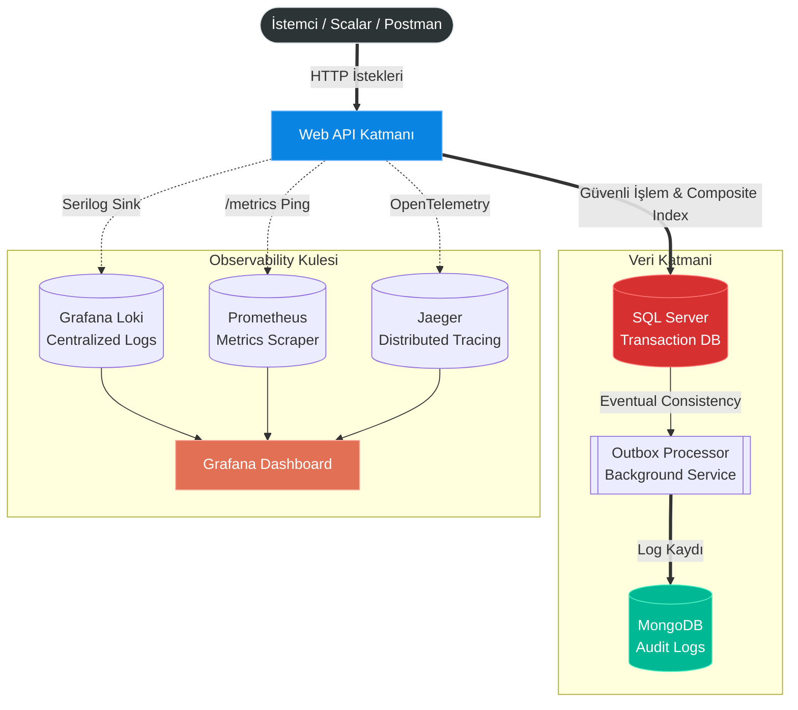

<div align="center">

# 🏦 Money Transfer Center (Enterprise Backend)

**Yüksek Erişilebilirlik (High Availability), Dağıtık İzlenebilirlik (Distributed Tracing) ve İleri Düzey Eşzamanlılık (Concurrency) Yönetimine Sahip Yeni Nesil Finansal İşlem Altyapısı.**

[](https://dotnet.microsoft.com/)
[](https://www.docker.com/)
[](https://www.microsoft.com/)
[](https://www.mongodb.com/)
[](https://grafana.com/)

</div>

---

## 🚀 Proje Hakkında

**Money Transfer Center**, para yatırma, çekme ve transfer işlemlerini yöneten, kurumsal (enterprise) seviyede bir .NET mikro-mimari projesidir. Sistem, finansal verilerin tutarlılığını garanti altına almak ve olası veri yarışlarını (Race Conditions) engellemek amacıyla **Concurrency Kilitleri** ve **Optimistic Locking** ile donatılmıştır. 

Ayrıca sistemin her bir milisaniyesi, **Grafana, Prometheus, Loki ve Jaeger**'dan oluşan tam teşekküllü bir Observability (Gözlemlenebilirlik) kulesi üzerinden anlık olarak izlenmektedir.

---

## 🏗️ Sistem Mimarisi & Veri Akışı

Projenin genel altyapısı, veritabanı iletişimi ve gözlemlenebilirlik araçlarının birbirleriyle olan etkileşimi aşağıdaki mimari şemada gösterilmiştir:



---

## 💎 Temel Mimari Prensipler (Architecture & Design Patterns)

Projede, sürdürülebilirliği maksimumda tutmak için endüstri standardı pattern'ler kullanılmıştır:

* **Clean Architecture:** Domain, Application, Infrastructure ve WebAPI katmanlarıyla "Loosely Coupled" (Gevşek Bağlı) bir yapı.
* **Domain-Driven Design (DDD):** İş kurallarının servislere saçılması yerine doğrudan `Entity` içine gömüldüğü *Rich Domain Model*.
* **Outbox Pattern:** İşlemlerin MSSQL'e yazılmasıyla MongoDB'ye log atılması arasındaki kopukluğu önleyen *Eventual Consistency* garantisi.
* **Concurrency Management (Eşzamanlılık):** Aynı anda gelen transfer isteklerinde paranın eksiye düşmesini (Race Condition) engelleyen `SemaphoreSlim` kilit mimarisi ve EF Core `RowVersion` (Optimistic Locking).
* **B-Tree Composite Indexing:** Milyonlarca satır veride SQL Server'ın yavaş Sort operasyonlarını engelleyen, Tarih ve ID bazlı *Bileşik Index* optimizasyonları.
* **Resilience & Fault Tolerance:** Hatalı API çağrılarında sistemin çökmesini engelleyen **Polly** (Retry, Circuit Breaker) entegrasyonu.

---

## 🛠️ Kullanılan Teknolojiler (Tech Stack)

| Kategori | Teknoloji / Araç |
| :--- | :--- |
| **Platform** | .NET 10 (C#) |
| **Veritabanları** | Microsoft SQL Server (Primary DB), MongoDB (Audit Log DB) |
| **ORM & Veri Erişimi** | Entity Framework Core, Repository & Unit of Work Pattern |
| **Gözlemlenebilirlik (Observability)** | OpenTelemetry, Prometheus, Jaeger, Grafana, Loki |
| **Loglama** | Serilog (Structured Logging with MongoDB & Loki Sinks) |
| **Güvenlik & Performans** | Rate Limiting, IP Blocking Middleware, Global Exception Handler |
| **Konteynerleştirme** | Docker, Docker Compose |

---

## 🚦 Kurulum ve Çalıştırma (Quick Start)

Mükemmel bir **Developer Experience (DX)** sunmak adına, tüm veritabanları, arka plan servisleri ve izleme araçları tek bir komutla ayağa kalkacak şekilde Dockerize edilmiştir.

### Ön Koşullar
* Bilgisayarınızda **Docker Desktop** kurulu ve çalışır durumda olmalıdır.

### Adım Adım Başlatma
1. Proje dizininde (Powershell / Terminal) komut satırını açın.
2. Sadece aşağıdaki komutu çalıştırın:
   ```bash
   docker compose up -d --build
   ```
3. Konteynerler ayağa kalktıktan sonra aşağıdaki bağlantıları kullanarak sistemi inceleyebilirsiniz:

| Servis | Bağlantı (URL) |
| :--- | :--- |
| **API & Scalar Dokümantasyonu** | `http://localhost:8080/scalar/v1` veya `/Scalar` |
| **Grafana (Metrikler & Loglar)** | `http://localhost:3000` *(Kullanıcı: admin, Şifre: admin)* |
| **Jaeger (Trace & Request İzleme)** | `http://localhost:16686` |

---

## 🛡️ Hata Yönetimi & Güvenlik
Proje, hataları kullanıcıya şifreleyerek (`HTTP 409 Conflict`, `HTTP 429 Too Many Requests` vb.) dönerken, arka planda tüm kritik detayları (Stack Trace, Hata satırı) **Loki** ve **MongoDB**'ye detaylı olarak yazar. Müşteri asla teknik detay görmez, sistem yöneticisi ise asla kör kalmaz.
